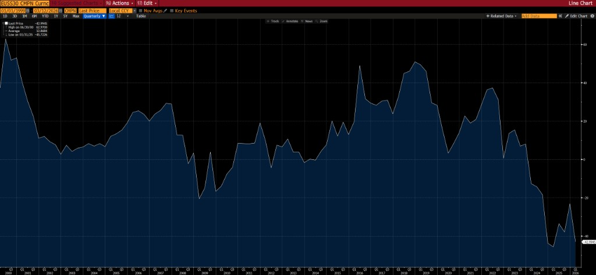

# Structural Anomalies in Long-End Fixed Income: An Analysis of Negative 30-Year European Swap Spreads (EUSS30)

## Abstract

In a theoretical, frictionless market, interest rate swap spreads should remain positive to reflect the counterparty credit risk inherent in interbank lending relative to "risk-free" sovereign debt. However, the European 30-year swap spread (EUSS30) has persistently exhibited negative values.

This paper examines the structural, regulatory, and mechanical drivers behind this anomaly. By analyzing the Liability-Driven Investment (LDI) squeeze, collateral scarcity, and the regulatory limits to arbitrage (such as Basel III and the Supplementary Leverage Ratio), this research demonstrates that negative swap spreads are not a market mispricing, but rather a rational reflection of systemic constraints, shadow capital costs, and the inelastic demand for long-duration synthetic assets.

## 1. Introduction and Theoretical Framework

Negative European 30-year swap spreads occur when the fixed rate of a 30-year interest rate swap falls below the yield of a 30-year sovereign government bond of the same maturity (typically the German Bund).

### The Mathematical Pricing

`Swap Spread = Swap Rate – Government Bond Yield`

*Figure: Historical EUSS30 (basis points). The spread has spent extended periods positive but collapsed into deep negative territory from late 2022 onward.*

In standard financial theory, this equation yields a positive number. A swap involves counterparty credit risk (historically unsecured interbank risk), whereas a developed-market sovereign bond is treated as fundamentally "risk-free." A negative swap spread implies a paradigm inversion: the market is effectively pricing the credit of a sovereign issuer as riskier, or more expensive to fund, than the interbank swap rate.

While fundamental supply and demand imbalances, such as governments issuing large volumes of long-term debt to fund deficits, play a foundational role, the persistence of deeply negative spreads at the 30-year tenor is driven primarily by complex structural plumbing in the modern financial system.

## 2. The Liability-Driven Investment (LDI) Squeeze

The primary structural driver of the negative 30-year swap spread is the highly inelastic demand from European pension funds and insurance companies, particularly concentrated in jurisdictions like the Netherlands, Denmark, and Germany.

### 2.1 The Regulatory Valuation Trap (Solvency II)

Under regulatory frameworks such as Solvency II, institutional investors must value their long-dated future liabilities using a discount curve frequently anchored to swap rates rather than bond yields. Because these liabilities often extend 30 years or more into the future, they carry massive "negative duration." Consequently, a decline in interest rates exponentially inflates the present value of these liabilities.

To hedge this duration mismatch, institutions enter the swaps market to receive fixed rates and pay floating rates. This demand is highly concentrated at the ultra-long end of the curve (30-year maturity). Because this demand is driven by regulatory compliance and risk management rather than speculative price sensitivity, it forces swap rates down regardless of broader macroeconomic conditions.

### 2.2 The Negative Convexity "Death Spiral"

This dynamic is exacerbated by the mathematical convexity of the positions. As interest rates decline toward zero or enter negative territory, the duration of pension liabilities extends further (negative convexity). This forces hedgers to constantly rebalance by "chasing the market" and receiving even more fixed-rate swaps as rates fall to maintain stable hedge ratios.

This creates a self-reinforcing feedback loop: lower rates lead to higher liability duration, which triggers more "receive-fixed" swap demand, ultimately driving swap rates even lower and widening the negative spread.

## 3. Collateral Scarcity and the Synthetic-Physical Mismatch

To understand why physical bond yields do not fall in tandem with swap rates, one must examine the fundamental mismatch between physical bond supply and synthetic derivative capacity.

### 3.1 Infinite Notional vs. Finite Physical Supply

The hedging needs of the European pension industry account for trillions of euros in long-dated liabilities. If these funds attempted to hedge solely via the cash market by purchasing 30-year German Bunds, they would exceed the total outstanding physical supply multiple times over.

Because an interest rate swap is a synthetic contract, its notional supply is theoretically infinite, constrained only by bank balance sheet capacity. Consequently, the swap market becomes the only venue deep enough to absorb this massive hedging volume. This creates a bifurcation: the overwhelming demand crushes the swap rate, but lacks the corresponding physical supply to drag sovereign bond yields down at the exact same velocity.

### 3.2 The Collateral Premium

A 30-year sovereign bond is not merely a yield-bearing asset; it functions as pristine collateral. Banks, clearinghouses, and counterparties require these specific bonds to meet margin requirements for the exact swaps being utilized by the pension funds.

This creates a "double demand" ecosystem:

- Pension funds demand the duration via swaps.
- The financial plumbing demands the bonds as collateral to back the swaps.

While this collateral premium keeps bond yields lower than they might organically be, it is often insufficient to keep pace with the aggressive collapse in swap rates caused by synthetic hedging demand.

## 4. Limits to Arbitrage: Why the Market Fails to Correct

Under pure "no-arbitrage" pricing theory, a persistent negative spread should be impossible. An arbitrageur would execute a "negative basis trade": buying the higher-yielding 30-year bond and paying fixed on the lower-rate 30-year swap, locking in a risk-free spread. The fact that this anomaly persists highlights the severe limits to arbitrage in the post-2008 financial landscape.

### 4.1 Regulatory Capital and the "Shadow Cost"

Modern banking regulations, specifically the Basel III framework and the Supplementary Leverage Ratio (SLR), require financial institutions to hold capital against the total size of their balance sheet, not merely risk-weighted assets.

A 30-year swap carries a massive notional weight. Even if the negative basis trade is technically risk-free and profitable, it consumes vital leverage ratio capacity. The "shadow cost" of this balance sheet space, defined as the opportunity cost of deploying that capital elsewhere, frequently exceeds the basis point profit generated by the negative swap spread. Thus, banks are disincentivized from deploying arbitrage capital to close the gap.

### 4.2 Repo Specialness and Financing Frictions

To execute the long-bond leg of the arbitrage trade, the investor must finance the bond purchase in the repurchase (repo) market. However, because the 30-year sovereign bond is highly scarce, as outlined in Section 3, it frequently goes "special" in the repo market.

When a bond is on special, the interest rate earned by lending cash against that specific bond collateral drops significantly, sometimes turning negative. Therefore, the cost of financing the bond position often entirely wipes out the theoretical profit of the negative spread. Ultimately, a negative swap spread acts as a market signal: the premium paid to fund via scarce pristine collateral in the repo market is more expensive than the baseline interbank swap rate.

### 4.3 Benchmark Transitions (ESTR/SOFR)

The global transition away from unsecured interbank rates (LIBOR) toward secured overnight financing rates, such as SOFR in the US and euro STR in Europe, has further justified this divergence. Because modern swap rates reflect an exceptionally safe, highly collateralized overnight rate compounded over 30 years, it is logically consistent for them to trade below the yield of a 30-year sovereign bond that carries term premium, liquidity noise, and minute long-term fiscal risk.

## 5. Conclusion

The persistent negative 30-year European swap spread (EUSS30) is a premier case study in modern market microstructure. Far from being a pricing error, it is the mathematical consequence of an immovable object meeting an unstoppable force. The unstoppable force is the mathematically necessitated, regulation-driven hedging demands of the European LDI complex, which creates infinite synthetic demand. The immovable object is the post-2008 regulatory framework, specifically Basel III capital constraints and repo market frictions, which fundamentally breaks the traditional arbitrage mechanisms that would otherwise force convergence.

So long as pension funds remain bound by swap-based discount curves and bank balance sheets remain constrained by leverage ratios, the negative swap spread will remain a structural fixture of the long-end fixed income market.
